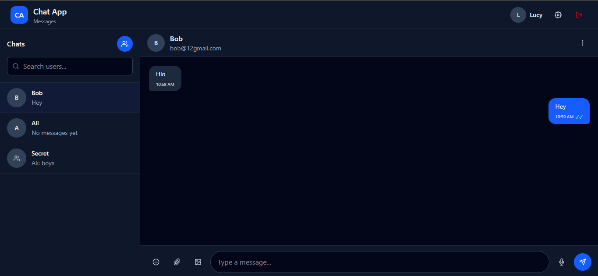
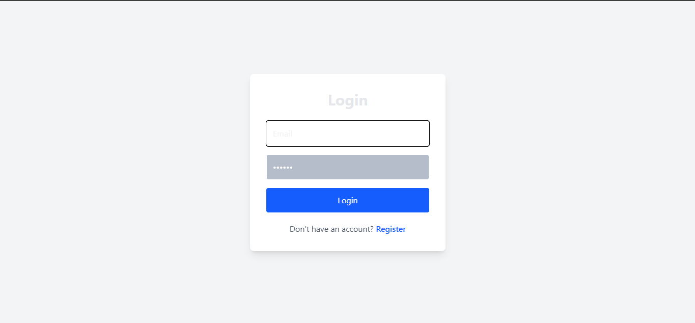
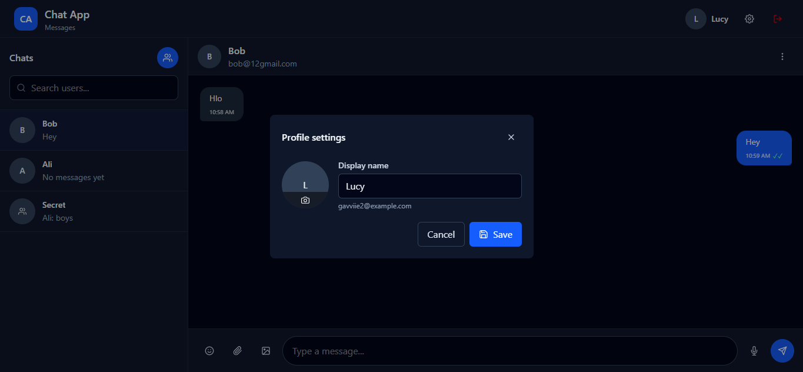
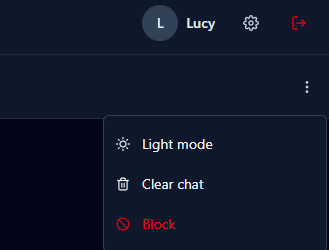

# Chat App

A real-time messaging application built with the MERN stack and Socket.io — supporting one-on-one and group chats, live typing indicators, read receipts, media attachments, and more.



## Features

- **Real-time messaging** via Socket.io — instant delivery, no refresh needed
- **One-on-one and group chats**, with group admin controls (rename, add/remove members)
- **Typing indicators** and **online presence** (see who's online)
- **Read receipts** — single check (sent), double check (delivered), colored double check (read)
- **Message actions** — reply, copy, edit, delete for me, delete for everyone
- **Attachments** — images, files, and voice notes (recorded directly in-browser)
- **Block / unblock users** in direct chats
- **Unread message counts** per chat
- **Dark mode** with persisted theme preference
- **JWT authentication** with protected routes

## Tech Stack

**Frontend**

- React 19 + Vite
- Tailwind CSS 4
- React Router
- Socket.io Client
- Axios

**Backend**

- Node.js + Express 5
- MongoDB + Mongoose
- Socket.io
- JWT (jsonwebtoken) + bcrypt for auth

## Screenshots

| Login                                   | Chat Window                                         |
| --------------------------------------- | --------------------------------------------------- |
|  |  |

| Profile Settings                                              | Chat Options (Dark Mode)                                        |
| ------------------------------------------------------------- | --------------------------------------------------------------- |
|  |  |

## Project Structure

```
chat-app/
├── client/          # React + Vite frontend
│   └── src/
│       ├── components/   # Chat UI, layout, shared components
│       ├── context/      # Auth and Chat context providers
│       ├── pages/        # Login, Register, Home
│       └── services/     # API service layer (axios)
├── server/          # Express + Socket.io backend
│   ├── controllers/      # Route handlers
│   ├── models/            # Mongoose schemas (User, Chat, Message)
│   ├── routes/            # Express routers
│   └── middleware/        # JWT auth middleware
└── docs/            # Additional documentation / assets
```

## Getting Started

### Prerequisites

- Node.js 20+
- MongoDB instance (local or Atlas)

### 1. Clone the repo

```bash
git clone https://github.com/sadiqqgavvi-gif/chat-app.git
cd chat-app
```

### 2. Set up the server

```bash
cd server
npm install
```

Create a `.env` file in `server/`:

```env
MONGO_URI=your_mongodb_connection_string
JWT_SECRET=your_jwt_secret
PORT=5000
CLIENT_URL=http://localhost:5173
```

Run the server:

```bash
npm run dev
```

### 3. Set up the client

```bash
cd ../client
npm install
```

Create a `.env` file in `client/`:

```env
VITE_API_URL=http://localhost:5000/api
VITE_SOCKET_URL=http://localhost:5000
```

Run the client:

```bash
npm run dev
```

The app will be available at `http://localhost:5173`.

## Live Demo

<!-- Once deployed, replace this line with your live URL, e.g.: -->
<!-- 🔗 [Try it live](https://your-deployed-app.vercel.app) -->

_Live demo coming soon._

## License

This project is open source and available for review as part of my portfolio.
